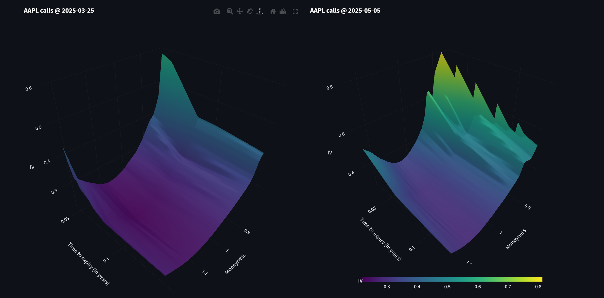
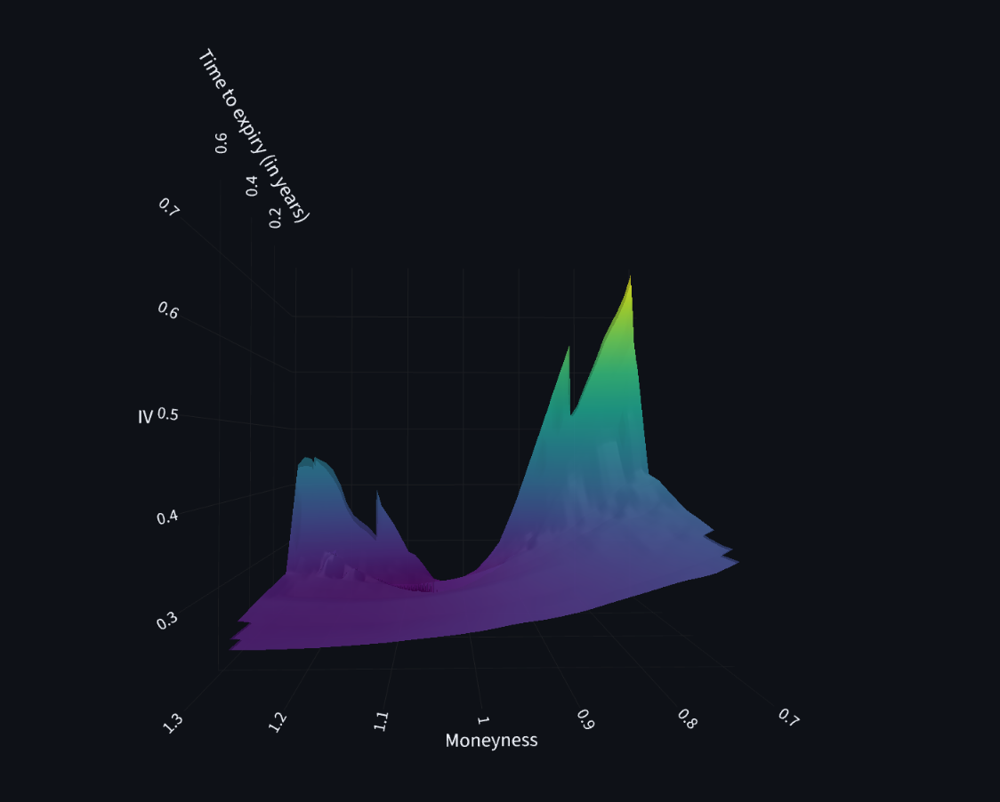

# Black-Scholes IV Surface

Builds and visualizes implied volatility surfaces for US equity options, from two sources: live option chains (yfinance) and historical end-of-day chains back to 2019 (the public DoltHub database `post-no-preference/options`). The frontend is a Streamlit app with side-by-side panels and a date slider for historical surfaces.

## Motivation

We wanted to learn how options actually work, and the best way to do that is to build something. Reading about a model only gets you so far. Turning Black-Scholes into real code, feeding it live market data and drawing the result forced us to understand each piece properly. The volatility surface was a good goal because it pulls most of those ideas into one picture.

## Running it

```bash
pip install -r requirements.txt

streamlit run app.py        # the app
python main.py              # CLI: one live AAPL surface in the browser
python -m bs.dolt_data AAPL # connectivity self-test for the historical source
```

Pick a ticker, choose Live or Historical. The first historical load downloads day by day, with progress in the terminal not the browser, so expect a few minutes. After that it reads from local files and is instant.

## What this does

An option's market price implies a volatility: the sigma that makes Black-Scholes reproduce that price. There is no algebraic way to get sigma out of the formula, so the code finds it numerically (Brent root-finding). Do this for every strike and expiration and plot sigma over moneyness (strike / stock level) and time to expiry, and you get the IV surface. Its shape, the smile across strikes and maturities, is how the market expresses its expectations about future volatility.

## Pipeline

Every surface goes through the same steps regardless of source:

1. fetch the raw chain rows plus a spot
2. `prepare_quotes`: pick one price per contract (bid/ask mid), drop zero-bid, crossed, and out-of-range rows
3. `add_iv`: solve Black-Scholes for sigma per contract
4. visualize: interpolate the scattered (moneyness, T, IV) points onto a grid and render

## Module map

| File | Responsibility |
| --- | --- |
| `bs/get_data.py` | Live chains from yfinance. Spot, every expiration's chain, seconds-precision T. No code at import time. |
| `bs/dolt_data.py` | Historical chains from DoltHub, one trading day per query, cached as one CSV per (ticker, day) in `bs/data_dolt/`. Joins an unadjusted daily close from yfinance. |
| `bs/black_scholes.py` | Model layer: `bs_price`, `calc_iv`, `prepare_quotes`, `anchor_to_forward`, `stitch_otm`, `add_iv`. |
| `bs/visualisation.py` | Solved dataframe to a Plotly figure: 3D surface. |
| `app.py` | Streamlit shell. Sidebar params (r, q) and filters, three cache layers, a log panel capturing each step's output. |
| `main.py` | The same pipeline without the interactive app. |

## Analysis

Black-Scholes turns each option price into one number, the implied volatility. You can think of it as the market's best guess about how much a stock will move between now and the day the option expires. Put those guesses on a 3D chart and you get a surface. The interesting part is watching the surface change, so here are two from Apple taken about six weeks apart. The one on the left is from 25 March 2025, a calm week. The one on the right is from 5 May 2025, about a month after the United States announced sweeping new tariffs on 2 April. That announcement set off one of the sharpest market selloffs in years.



The change is hard to miss. Before the tariffs the surface sits low and fairly smooth, with implied volatility running from roughly 0.3 to 0.6. After the shock it climbs and turns jagged, and the tallest points reach about 0.8. The biggest jumps tend to land on the options that expire soonest. That fits what you'd expect. A sudden surprise mostly worries people about the next few weeks, not the next year, so the near-dated options get the largest jump in price, and a bigger price means a higher implied volatility. By early May the worst of the panic had passed and the market had clawed back most of the drop, but the surface still hadn't returned to its calm March shape. The market was still charging extra for the chance of more trouble ahead.

One more shape is worth a look. Take a single surface and run your eye across the strikes at one expiry, and you get a curve people call the volatility smile.



Notice the dip in the middle and the way both sides curl up. The low middle is where the strike sits close to the current stock price. The raised edges are the options betting on a big move, a fall on one side and a jump on the other. If the world behaved the way Black-Scholes assumes, with prices drifting along a tidy bell curve, every strike would show the same volatility and this curve would be flat. It isn't. Real stocks gap on news, and crashes happen more often than a bell curve says they should. So people pay up for the options that pay off in a big move, and the protection against a fall is usually wanted most. More demand lifts the price, and a higher price shows up as a higher implied volatility, which is why the side with strikes below today's price sits a bit taller here. The smile is really the market correcting the model. It knows the simple bell curve underrates the extremes, so it prices the difference back in.

## Limitations

- **Constant r.** One rate for every option and date, while in reality we know it changes constantly, set a period-appropriate r by hand for deep history.
- **Filled-in gaps.** The real data is a scatter of separate points with gaps between them. To draw one continuous sheet the code stretches a surface across those points and estimates the values in the empty spaces. The traded points are solid. The smooth stretches between them are a best guess, so treat the surface as a sketch and not an exact map.
- **One frozen moment.** Each surface comes from a single point in time, the end of the trading day for the historical data. Volatility shifts all day, so a still picture can't show that movement. A stale or barely-traded price can also pull one corner of the surface the wrong way without it being obvious.

## Notes

- Coverage is ~2100 US symbols. A missing ticker returns zero rows on every day. Check with `python -m bs.dolt_data TICKER`.
- yfinance is free and breaks sometimes.
- DoltHub is also not 100 percent reliable.
- This is not tradeable output.
- Option data of high quality are expensive.
